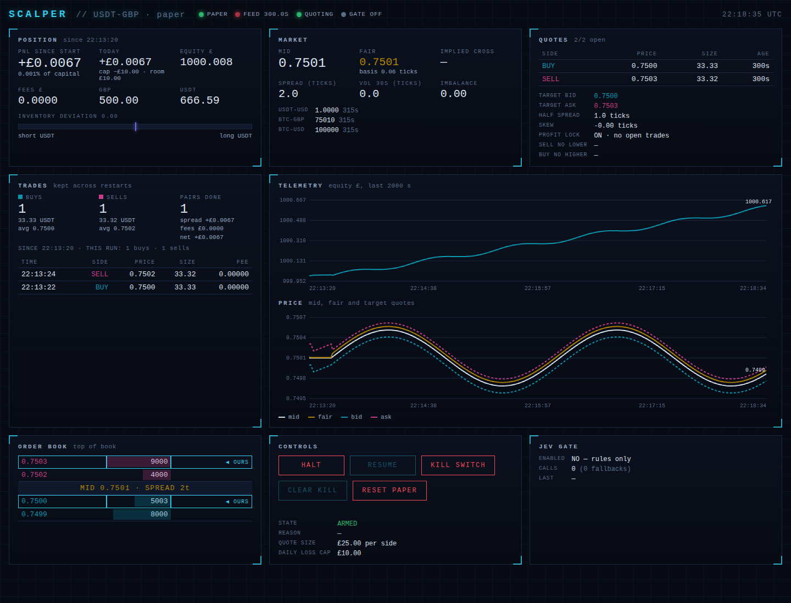

# trading — Coinbase USDT-GBP scalper

A 24/7 passive spread-capture ("scalping") bot for **USDT-GBP on Coinbase Advanced Trade**,
written in Python, with an optional **TypeSafe AI Jev** decision gate.

> **Read this first.** USDT-GBP is a fiat/stablecoin pair. It has no trend to ride; it moves
> a few tenths of a percent a day with GBP/USD. The only edge available to a retail bot is
> posting post-only quotes on both sides of the book and earning the spread. That is viable
> **only** at Coinbase's stable-pair fee rate (0.00% maker). At the standard 0.60% maker rate
> every round trip loses money by construction. The bot checks your real fee tier at startup
> and refuses to trade if the maths does not work. Nothing here is financial advice.

## What it does

1. Streams the USDT-GBP level-2 book, trade tape and tickers for USDT-USD, BTC-GBP and BTC-USD.
2. Computes a **fair value** = `USDT-USD × BTC-GBP / BTC-USD` (a liquid proxy for the pair)
   blended with the book microprice.
3. Posts one **post-only** bid and one ask around fair, widened by recent volatility and
   skewed against inventory (long USDT → lower quotes, short → higher). Re-quotes at most
   once per second per side and never crosses the book.
4. Fills come from the authenticated `user` channel (live) or a conservative queue-position
   fill model (paper / backtest). The opposite quote works the inventory back to target.
5. Optional **Jev gate**: asks TypeSafe's System One model "quote bid? quote ask? what size?"
   with calibrated probabilities. Rules still decide the prices; Jev can only veto or resize.
   Timeouts fall back to rule-only. Off by default.

Grok is a chat connector to Coinbase for manual trades; it is not a bot engine and is not used.

## Dashboard

Paper and live modes serve a sci-fi style HUD at `http://localhost:9108/` on the same port as
the metrics: position and PnL, market and fair value, working quotes, order-book ladder with
your own orders highlighted, equity and price charts with hover crosshairs, fills log, Jev gate
status, and **Halt / Resume / Kill switch** controls. It polls once a second and needs no
external assets, so it works on an air-gapped VPS.



JSON behind it, for your own tooling: `/api/state`, `/api/series`, `/api/fills?limit=50`,
`/api/equity?limit=500`, and `POST /api/control {"action": "halt|resume|kill_on|kill_off"}`.
The port is bound to `127.0.0.1` in `docker-compose.yml`; put it behind an SSH tunnel or an
authenticating reverse proxy before exposing it, there is no login.

## Restarts keep your account

Paper and live mode save their state in the journal at `data/journal.sqlite`. In Docker it
lives on the `scalper-data` volume. After a restart, a rebuild or a crash the bot picks up
where it left off:

- **Paper:** GBP and USDT balances, PnL since the account started, today's PnL, and fees paid.
- **Paper and live:** open trades for the profit lock, plus the full fill history and buy/sell
  counts on the dashboard.
- **Live:** balances are always read from Coinbase. The PnL baseline comes from the journal.

Resting orders are still cancelled on shutdown and re-posted on startup. That is deliberate,
so nothing is left on the book while the bot is down.

To start the paper account over, press **Reset paper** on the dashboard. Balances go back to
`CAPITAL_GBP`, and counts and open trades start from zero. Old fills stay in the journal but
are no longer counted. `docker compose down -v` deletes the volume and everything in it.

## Profit lock

On by default (`PROFIT_LOCK=true`). Every fill is recorded as an open trade until the opposite
side closes it:

- After a **buy**, the sell quote is never below that buy price plus both maker fees plus
  `MIN_PROFIT_TICKS`. With a 0.06% maker fee, a buy at 0.7500 can only be sold at 0.7511 or
  higher.
- After a **sell**, the buy-back quote is never above the sell price minus both fees minus the
  margin.
- The cheapest open buy is sold first, and the dearest open sell is bought back first.
- USDT the bot started with has no entry price, so it is not restricted.
- In live mode the open trades are rebuilt from the journal on restart.

The trade-off: the bot never takes a loss to get flat. If the price falls after a buy, that
USDT is held until the price recovers. Meanwhile the inventory limit stops further buying and
the daily loss cap still watches the marked-to-market value. The Quotes panel on the dashboard
shows the open trades and the current "sell no lower" and "buy no higher" prices.

## Risk controls (defaults for < £1,000)

| Guard | Default | Env var |
|---|---|---|
| Order notional | £25 per quote | `ORDER_NOTIONAL_GBP` |
| Max USDT inventory | ±50% of capital around target | `MAX_INVENTORY_PCT` |
| Max open orders | 2 (one per side) | `MAX_OPEN_ORDERS` |
| Daily loss cap | 1% of capital → cancel all, halt until next UTC day | `DAILY_LOSS_CAP_PCT` |
| Stale market data | 5 s without a book update → cancel all | `STALE_BOOK_SECONDS` |
| Spread sanity | > 20 ticks or one-sided book → do not quote | `MAX_SPREAD_TICKS` |
| Fee preflight | round-trip maker fee ≥ target edge → refuse to start | `MIN_EDGE_TICKS` |
| Live arming | `MODE=live` **and** `LIVE_TRADING=I_UNDERSTAND` | |
| Kill switch | create a file named `KILL_SWITCH` in the working dir | `KILL_SWITCH_PATH` |
| Startup / shutdown | cancel every open order on the product | |

API key scopes: **View + Trade only. Never grant Transfer.**

## Modes

| Mode | What happens | Needs API key |
|---|---|---|
| `record` | Save the raw WebSocket stream to `data/recordings/*.jsonl.gz`, no trading | no |
| `backtest` | Replay a recording through the real engine with the paper exchange | no |
| `paper` | Live market data, simulated fills, real fee tier if a key is present (default) | optional |
| `live` | Real post-only orders | yes |

## Quick start

```bash
python3 -m venv .venv && . .venv/bin/activate
pip install -e ".[dev,jev]"
cp .env.example .env            # edit keys, MODE, CAPITAL_GBP
pytest                          # 35 unit + replay tests, no network needed

python -m scalper record        # step 1: collect a day or two of tape
python -m scalper backtest --recording "data/recordings/*.jsonl.gz"
python -m scalper paper         # step 2: paper trade against the live book
MODE=live LIVE_TRADING=I_UNDERSTAND python -m scalper   # step 3, see checklist
```

Metrics: `http://localhost:9108/metrics` (Prometheus). Health: `http://localhost:9108/healthz`
(503 when market data is stale; `halted` is reported in the body but is not a failure, so a
daily-loss halt is never "fixed" by an automatic restart).

## Running 24/7

**Docker Compose on a VPS (recommended):**

You need Docker Engine plus the Compose v2 plugin. Check with `docker compose version`.

```bash
cp .env.example .env && $EDITOR .env
docker compose up -d --build
docker compose logs -f
```

If you get `unknown shorthand flag: 'd' in -d`, the Compose plugin is missing. This is common
on a Mac after `brew install docker`, which installs only the client. Either install Docker
Desktop, or use Homebrew:

```bash
brew install docker-compose colima
mkdir -p ~/.docker/cli-plugins
ln -sfn "$(brew --prefix)/opt/docker-compose/bin/docker-compose" ~/.docker/cli-plugins/docker-compose
colima start
```

Docker is only needed for the always-on server. On a laptop, `python -m scalper paper` runs
without it.

**If the container will not start**, read its log first:

```bash
docker compose logs --tail=50 scalper
```

Configuration problems do not crash-loop. The fee check failing, a bad API key, or live mode
not armed puts the bot in a **BLOCKED** state: it stays up, places no orders, and shows the
reason at `http://localhost:9108/`. Fix `.env`, then `docker compose up -d --force-recreate`.
A container that keeps restarting has hit something else, such as a network outage, and the
log will say what.

`restart: always`, a health check, a 30 s stop grace so SIGTERM cancels open orders, and a
named volume for the SQLite journal and recordings. Host it in AWS us-east-1 (Coinbase's
region) for the lowest latency.

**Kubernetes:** `deploy/k8s/` has a single-replica `Recreate` Deployment (two copies must never
quote at once), ConfigMap, PVC and a Secret template.

```bash
cp deploy/k8s/secret.example.yaml deploy/k8s/secret.yaml && $EDITOR deploy/k8s/secret.yaml
kubectl apply -k deploy/k8s && kubectl apply -f deploy/k8s/secret.yaml
```

## Go-live checklist

1. Create a CDP API key with **View + Trade** only.
2. `MODE=paper python -m scalper` and read the `fee_check` line. If it says `NOT VIABLE`, your
   account is not on stable-pair pricing for USDT-GBP. **Stop; the strategy cannot work.**
3. Run `record` for 24–48 h, then `backtest`. Look at fills, fees and PnL in the summary and in
   `data/backtest.sqlite` (`fills`, `equity`, `orders` tables).
4. Run `paper` for at least a week. Compare `JEV_ENABLED=false` vs `true` in the `decisions`
   table before ever enabling Jev live.
5. Go live with the default £25 quote size and the 1% daily loss cap. Watch
   `scalper_pnl_gbp`, `scalper_inventory_deviation`, `scalper_rejects_total` and
   `scalper_guard_blocks_total`.

## Configuration

Everything is an environment variable (or `.env`); see `.env.example` for the full list and
`scalper/config.py` for defaults. Notable knobs:

- `MIN_EDGE_TICKS` minimum half-spread in ticks (tick = £0.0001 on USDT-GBP)
- `VOL_MULTIPLIER`, `VOL_WINDOW_SECONDS` how much recent range widens the quotes
- `INVENTORY_SKEW_TICKS` how hard quotes lean against inventory
- `FAIR_BLEND_WEIGHT` weight of the cross-implied price vs the local microprice
- `REQUOTE_MIN_INTERVAL_S`, `MAX_REST_SECONDS` re-quote throttle and max order age
- `JEV_ENABLED`, `JEV_THRESHOLD`, `JEV_TIMEOUT_S`, `TYPESAFE_API_KEY`

## Layout

```
scalper/
  config.py            pydantic settings
  engine.py            quoting loop, fills, risk wiring (shared by all modes)
  main.py              CLI and mode wiring
  marketdata/          ws_client (Coinbase WS), orderbook (L2), fair_value (cross + vol)
  strategy/            quoter (pure pricing), inventory (position and PnL)
  risk/                guards (hard vetoes), fee_check (startup viability)
  execution/           exchange protocol, paper simulator, coinbase_live adapter
  gate/                jev_gate (optional TypeSafe Jev decision gate)
  journal/             SQLite journal
  observability/       Prometheus metrics + /healthz
  backtest/            recorder and replay
tests/                 unit tests and an end-to-end replay test
deploy/k8s/            Kubernetes manifests
```

## Honest expectations

Even at 0% maker fees the gross edge on a thin fiat-stablecoin pair is a few basis points per
round trip, and there will be days of adverse selection when GBP/USD moves. The Coinbase retail
API gives you seconds, not microseconds; this is a market-making bot, not true HFT. Treat the
first weeks as data collection, not income.
